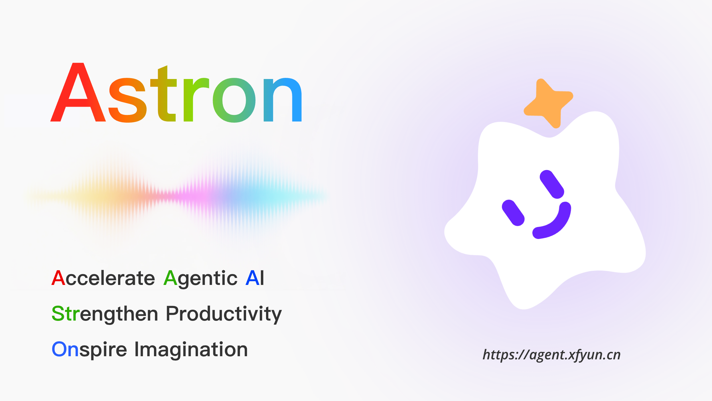

[](https://agent.xfyun.cn)

<div align="center">

[](../LICENSE)
[](https://github.com/iflytek/astron-agent/stargazers)
[](https://deepwiki.com/iflytek/astron-agent)

[English](../README.md) | [简体中文](../zh/README.md) | 日本語

</div>

## 🔭 Astron Agent とは

Astron Agent は、**エンタープライズグレードで商用利用可能**な Agentic Workflow 開発プラットフォームです。AI ワークフローオーケストレーション、モデル管理、AI および MCP ツール統合、RPA 自動化、チームコラボレーション機能を統合しています。
本プラットフォームは**高可用性**デプロイメントをサポートし、組織がスケーラブルで本番対応可能なインテリジェントエージェントアプリケーションを迅速に構築し、将来に向けた AI 基盤を確立することを可能にします。

### なぜ Astron Agent を選ぶのか？

- **安定性と信頼性**: 科大讯飞（iFLYTEK）Astron Agent プラットフォームと同じコア技術に基づき、エンタープライズグレードの信頼性を提供。高可用性バージョンを完全にオープンソースで公開。
- **クロスシステム統合**: インテリジェント RPA をネイティブに統合し、企業の内部・外部システムを効率的に接続。Agent と企業システム間のシームレスな連携を実現。
- **エンタープライズグレードのオープンエコシステム**: 各種業界モデルやツールとの深い互換性を持ち、カスタム拡張をサポート。多様な企業シナリオに柔軟に対応。
- **商用利用可能**: Apache 2.0 ライセンスで公開。商用制限なしで自由に商用利用可能。

### 主な機能

- **エンタープライズグレードの高可用性:** 開発、構築、最適化、管理のフルスタック機能。ワンクリックデプロイメントに対応し、高い信頼性を実現。
- **インテリジェント RPA 統合:** クロスシステムのプロセス自動化を実現。制御可能な実行で Agent を強化し、「判断からアクションまで」の完全なループを達成。
- **すぐに使えるツールエコシステム:** [科大讯飞オープンプラットフォーム](https://www.xfyun.cn)の大規模な AI 機能とツールを統合。数百万の開発者によって検証済みで、追加開発なしにプラグアンドプレイで統合可能。
- **柔軟な大規模モデルサポート:** API ベースのモデルアクセスと検証から、エンタープライズレベルの MaaS（Model as a Service）オンプレミスクラスターのワンクリックデプロイメントまで、あらゆる規模のニーズに対応。

## 📰 ニュース

### 🔄 開催中

- **[Astron 産業インテリジェンスハッカソン](https://awesome-astron-workflow.dev/activities/astron-industrial-intelligence-hackathon)**  🎤 <a href="https://github.com/lyj715824"> @lyj715824</a> <a href="https://github.com/horizon220222"> @horizon220222</a>

### 📅 過去のイベント

- **[Astron ハッカソン @ 2025 iFLYTEK グローバル 1024 開発者フェスティバル](https://luma.com/9zmbc6xb)**  🎤 <a href="https://github.com/mklong"> @mklong</a>
- **[Astron Agent 鄭州ミートアップ](https://github.com/iflytek/astron-agent/discussions/672)**  🎤 <a href="https://github.com/lyj715824"> @lyj715824</a> <a href="https://github.com/wowo-zZ"> @wowo-zZ</a>
- **[Astron on Campus @ 浙江財経大学](https://mp.weixin.qq.com/s/oim_Z0ckgpFwf5jOskoJuA)**  🎤 <a href="https://github.com/lyj715824"> @lyj715824</a>
- **[Astron Agent & RPA・青島ミートアップで Agentic AI を体験！](https://github.com/iflytek/astron-agent/discussions/740)**  🎤 <a href="https://github.com/vsxd"> @vsxd</a> <a href="https://github.com/doctorbruce"> @doctorbruce</a> <a href="https://github.com/MaxwellJean"> @MaxwellJean</a>
- **[Astron トレーニングキャンプ・第1期](https://www.aidaxue.com/astronCamp)**  🎤 <a href="https://github.com/lyj715824"> @lyj715824</a> <a href="https://github.com/Thomas1024-Astron"> @Thomas1024-Astron</a> <a href="https://github.com/abelzha"> @abelzha</a>
- **[Astron 講演 @ 重慶ミニテックフェスト](https://mp.weixin.qq.com/s/HROf1zZpkPVDSsCQrv2jRg)**  🎤 <a href="https://github.com/lyj715824"> @lyj715824</a>
- **[Astron Agent @ MWC バルセロナ 2026](https://www.iflytek.com/en/news-events/mwc2026.html)**
- **[Astron Agent & RPA・合肥ミートアップ](https://mp.weixin.qq.com/s/tDJaoOLUrjBlgMLDurvHCw)**  🎤 <a href="https://github.com/lyj715824"> @lyj715824</a> <a href="https://github.com/doctorbruce"> @doctorbruce</a>

## 🚀 クイックスタート

異なるシナリオに対応するため、2つのデプロイメント方法を提供しています：

### 方法1: Docker Compose（クイックスタートに推奨）

```bash
# リポジトリをクローン
git clone https://github.com/iflytek/astron-agent.git

# Docker デプロイメントディレクトリに移動
cd docker/astronAgent

# 環境設定をコピー
cp .env.example .env

# 環境変数を設定
vim .env
```

環境変数の設定については、ドキュメントを参照してください：[DEPLOYMENT_GUIDE_WITH_AUTH.md](https://github.com/iflytek/astron-agent/blob/main/docs/DEPLOYMENT_GUIDE_WITH_AUTH.md#step-2-configure-astronagent-environment-variables)

```bash
# すべてのサービスを起動（Casdoor を含む）
docker compose -f docker-compose-with-auth.yaml up -d
```

#### 📊 サービスアクセスアドレス

起動後、以下のアドレスでサービスにアクセスできます：

**認証サービス**
- **Casdoor 管理画面**: http://localhost:8000

**AstronAgent**
- **アプリケーションフロントエンド（nginx プロキシ）**: http://localhost/

**注意**
- Casdoor デフォルトログイン情報: ユーザー名: `admin`、パスワード: `123`

### 方法2: Helm（Kubernetes 環境向け）

> 🚧 **注意**: Helm チャートは現在開発中です。アップデートをお待ちください！

```bash
# 近日公開
# helm repo add astron-agent https://iflytek.github.io/astron-agent
# helm install astron-agent astron-agent/astron-agent
```

---

> 📖 完全なデプロイメント手順と設定の詳細については、[デプロイメントガイド](DEPLOYMENT_GUIDE_WITH_AUTH.md)をご覧ください

## 📖 Astron Cloud の利用

**Astron を試す**：Astron Cloud は、Agent の作成と管理のためのすぐに使える環境を提供します。[https://agent.xfyun.cn](https://agent.xfyun.cn) からクイックアクセスできます。

**利用ガイド**：詳細な利用方法については、[クイックスタートガイド](https://www.xfyun.cn/doc/spark/Agent02-%E5%BF%AB%E9%80%9F%E5%BC%80%E5%A7%8B.html)をご参照ください。

## 📚 ドキュメント

- [🚀 デプロイメントガイド](DEPLOYMENT_GUIDE.md)
- [🔧 設定](CONFIGURATION.md)
- [🚀 クイックスタート](https://www.xfyun.cn/doc/spark/Agent02-%E5%BF%AB%E9%80%9F%E5%BC%80%E5%A7%8B.html)
- [📘 開発ガイド](https://www.xfyun.cn/doc/spark/Agent03-%E5%BC%80%E5%8F%91%E6%8C%87%E5%8D%97.html#_1-%E6%8C%87%E4%BB%A4%E5%9E%8B%E6%99%BA%E8%83%BD%E4%BD%93%E5%BC%80%E5%8F%91)
- [💡 ベストプラクティス](https://www.xfyun.cn/doc/spark/AgentNew-%E6%8A%80%E6%9C%AF%E5%AE%9E%E8%B7%B5%E6%A1%88%E4%BE%8B.html)
- [📱 ユースケース](https://www.xfyun.cn/doc/spark/Agent05-%E5%BA%94%E7%94%A8%E6%A1%88%E4%BE%8B.html)
- [❓ FAQ](https://www.xfyun.cn/doc/spark/Agent06-FAQ.html)

## 🤝 コントリビューション

あらゆる種類のコントリビューションを歓迎します！[コントリビューションガイド](../CONTRIBUTING.md)をご覧ください

## 🌟 スター履歴

<div align="center">
  
</div>

## 📞 サポート

- 💬 コミュニティディスカッション: [GitHub Discussions](https://github.com/iflytek/astron-agent/discussions)
- 🐛 バグ報告: [Issues](https://github.com/iflytek/astron-agent/issues)
- 👥 WeChat Work グループ:

<div align="center">
  
</div>

## 📄 オープンソースライセンス

本プロジェクトは [Apache 2.0 ライセンス](../LICENSE)の下で公開されています。自由に使用、変更、配布、商用利用が可能で、制限はありません。
