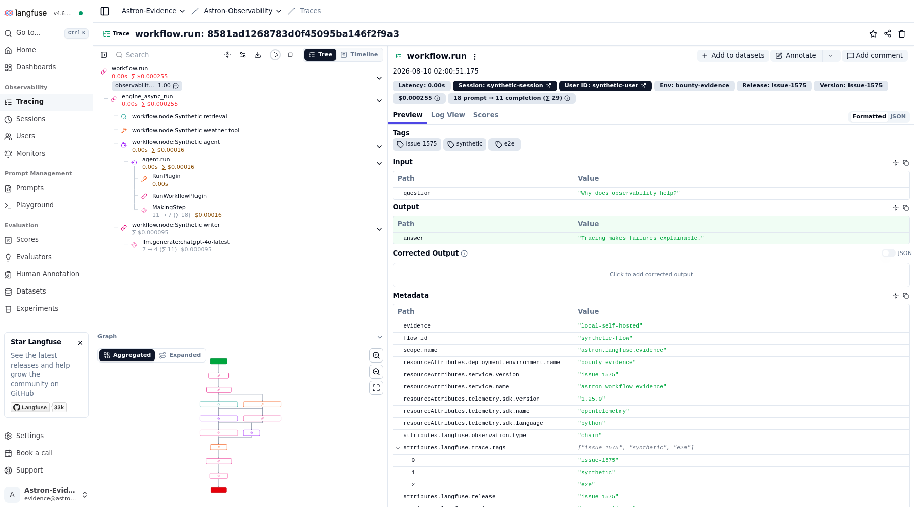
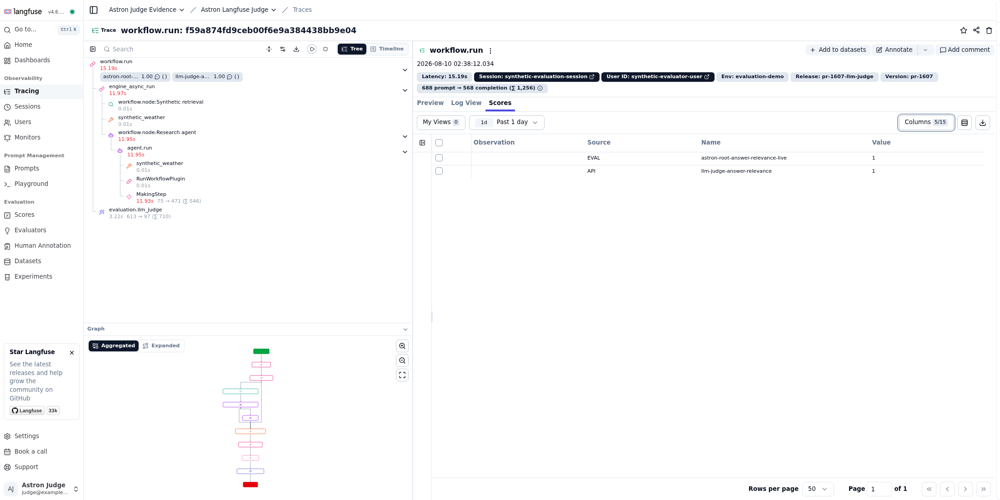

# Langfuse 可观测性

Astron Agent 可以通过原生 OTLP/HTTP bridge 将已有的 OpenTelemetry Trace
导出到 Langfuse。该 bridge 不依赖 Langfuse Python SDK，会保留 Astron 工作流与
Agent 的 Span 层级，并补充 Langfuse 用于识别生成、工具、Token 用量、延迟和
Trace 筛选的语义属性。

传输与属性映射遵循 Langfuse 的
[v4 自定义接入检查表](https://langfuse.com/integrations/native/opentelemetry/migration-to-v4)
及官方定义的
[Observation 类型](https://langfuse.com/docs/observability/features/observation-types)。

> Langfuse 导出默认关闭。启用后会把遥测数据发送到所配置的 Langfuse 部署，
> 因此在接入生产流量前必须检查隐私配置。

## 支持版本

- 支持 Langfuse v4.x；已对自托管 Langfuse v4.6.0 完成端到端验证。
- 当前 bridge 使用 v4 observations-first 属性模型和 ingestion header，且没有
  v3 测试矩阵，因此不声明支持 Langfuse v3；不支持 Langfuse v2。
- Astron 要求 Python 3.11 或更高版本。Workflow 锁定 OpenTelemetry 1.25.x；
  Agent 和共享 bridge 已验证 1.27.x，并将 OpenTelemetry 依赖限制在受支持的
  2.0 之前。
- Langfuse 仅支持 OTLP over HTTP/protobuf；本集成不支持 OTLP/gRPC。

## Bridge 的工作方式

- Workflow 和 Agent 服务继续使用已有的 OpenTelemetry tracer provider 与嵌套
  Span。
- Langfuse 使用独立的批量 OTLP/HTTP exporter，并与 Astron 现有 OTLP exporter
  及本地 Span 日志并行工作。
- `OTLP_ENABLE` 仍只控制原有的通用 OTLP 链路；`LANGFUSE_ENABLED` 独立控制
  Langfuse 链路。
- Astron 根据 `LANGFUSE_HOST` 自动生成 Langfuse v4 兼容的 Trace endpoint：
  `<LANGFUSE_HOST>/api/public/otel/v1/traces`。这里只应配置部署基础 URL，不要
  填写完整 OTLP endpoint。
- Astron 在内存中使用 Langfuse 项目的 Public Key 和 Secret Key 为请求鉴权，
  不会把凭据添加为 Span 属性。
- 仅在启用 Langfuse 时，Workflow 到 Agent 及嵌套 Workflow 调用才传播标准
  W3C `traceparent`/`tracestate`。Astron 使用独立、仅供内部使用的密钥对 carrier
  生成短时 HMAC，并绑定 HTTP 方法、目标服务/路径、租户身份和时间戳。未签名、
  过期、在其他端点或租户重放、或被修改的公共 Header 会开启新的本地 Trace，
  且不能提供 Langfuse Trace 级字段。签名传播 Header 不会写入 Span event 或节点
  日志。
- 只有开关为 true、两个项目 Key 均存在且 Host、Environment 合法时，Langfuse
  才真正启用；其他情况下集成保持完全惰性：不会新增 Langfuse/GenAI 属性或
  baggage，不会改变模型供应方请求体或流式帧、继承远程 parent、重命名现有
  Span，也不会向常规 OTLP/file pipeline 添加仅服务于 Langfuse 的子 Span。

同时启用两个 exporter 时，一次执行可以分别发送到现有 collector 和 Langfuse。
除非明确需要重复上报，否则不要把两个 exporter 都指向同一个 Langfuse 项目。

## 配置

Workflow 与 Agent 服务使用相同配置。

| 变量 | 默认值 | 说明 |
| --- | --- | --- |
| `LANGFUSE_ENABLED` | `false` | 启用独立的 Langfuse exporter。 |
| `LANGFUSE_PUBLIC_KEY` | 空 | Langfuse 项目 Public Key，启用时必填。 |
| `LANGFUSE_SECRET_KEY` | 空 | Langfuse 项目 Secret Key，启用时必填。 |
| `ASTRON_TRACE_CONTEXT_SECRET` | 空 | Agent 与 Workflow 共享、仅供 Astron 内部使用的独立密钥；建议配置以保持可信跨服务 Trace 连续性。 |
| `LANGFUSE_HOST` | `https://cloud.langfuse.com` | Langfuse Cloud 或自托管实例的基础 URL。 |
| `LANGFUSE_CAPTURE_INPUT_OUTPUT` | `false` | 允许提示词/输入及响应/输出内容离开 Astron。 |
| `LANGFUSE_MAX_ATTRIBUTE_LENGTH` | `8192` | 导出的字符串属性最大长度。 |
| `LANGFUSE_ENVIRONMENT` | `default` | 小写环境标签（仅 `[a-z0-9_-]`，最长 40 个字符，且不能以 `langfuse` 开头）。非法值会禁用 exporter。 |
| `LANGFUSE_RELEASE` | 空 | 可选的应用发布或部署标签。 |

启用导出前必须同时配置两个项目 Key。请为 `ASTRON_TRACE_CONTEXT_SECRET` 生成
单独的强随机值，并向 Agent 和 Workflow 注入相同值。它仅用于内部 Trace
上下文鉴权，可与 Langfuse 凭据独立轮换，也不会发送给 Langfuse。两个 Secret
都应按生产凭据管理：通过 Secret 管理器在运行时注入，禁止写入源码、截图或
命令日志。若未配置 Astron 内部密钥，本地导出仍可工作，但跨服务 Trace 上下文
不会被信任或延续。

### Docker Compose

创建本地部署环境文件并填写项目配置：

```bash
cd docker/astronAgent
cp .env.example .env
```

```dotenv
LANGFUSE_ENABLED=true
LANGFUSE_PUBLIC_KEY=pk-lf-your-project
LANGFUSE_SECRET_KEY=sk-lf-your-project
ASTRON_TRACE_CONTEXT_SECRET=replace-with-a-separate-random-secret
LANGFUSE_HOST=https://cloud.langfuse.com
LANGFUSE_CAPTURE_INPUT_OUTPUT=false
LANGFUSE_MAX_ATTRIBUTE_LENGTH=8192
LANGFUSE_ENVIRONMENT=development
LANGFUSE_RELEASE=local-observability-demo
```

启动正常 Astron 部署；如果服务已经运行，则重新创建两个服务以载入环境变量：

```bash
docker compose up -d
# 已有部署：
docker compose up -d --force-recreate core-workflow core-agent
```

Compose 会把所有配置项同时传入两个服务。自托管 Langfuse 与 Astron 位于同一
Docker 网络时，应使用其服务名，例如 `http://langfuse-web:3000`。Astron 容器
内的 `localhost` 指向该容器自身，而不是 Docker 主机。

### 源码与 Helm 部署

源码部署可以在服务环境中导出这些变量，也可以同时设置
`core/workflow/config.env` 和 `core/agent/config.env`。配置变化后需要重启两个
服务。

Helm 部署应先通过凭据文件或现有 ExternalSecret/GitOps 流程创建 Kubernetes
Secret。默认键名为 `public-key`、`secret-key` 和 `trace-context-secret`；禁止
把凭据值写入 Helm values：

```bash
ASTRON_NAMESPACE=astron-agent
LANGFUSE_SECRET_NAME=astron-langfuse
kubectl create namespace "$ASTRON_NAMESPACE" --dry-run=client -o yaml | kubectl apply -f -
kubectl --namespace "$ASTRON_NAMESPACE" create secret generic "$LANGFUSE_SECRET_NAME" \
  --from-file=public-key=/secure/path/langfuse-public-key \
  --from-file=secret-key=/secure/path/langfuse-secret-key \
  --from-file=trace-context-secret=/secure/path/astron-trace-context-secret \
  --dry-run=client -o yaml | kubectl apply -f -

helm upgrade --install astron-agent ./helm/astron-agent \
  --namespace "$ASTRON_NAMESPACE" --create-namespace \
  --set langfuse.enabled=true \
  --set-string langfuse.existingSecret.name="$LANGFUSE_SECRET_NAME" \
  --set-string langfuse.environment=staging
```

以上命令用于首次安装。对于已有 release，应把 `langfuse` 配置合并进受控的完整
values 文件，并在 `helm upgrade` 时继续传入该文件；只复制少量 `--set` 参数不会
保留其他自定义值。模板也兼容复用旧 values、其中尚不存在 `langfuse` map 的升级
场景。

Chart 只会向 Agent 和 Workflow Deployment 注入同一组非敏感配置与 Secret
引用。启用 Langfuse 却未指定已有 Secret 名称时，模板渲染会直接失败。若已有
Secret 使用其他键名，可设置 `langfuse.existingSecret.publicKeyKey` 和
`langfuse.existingSecret.secretKeyKey`；独立的内部密钥可通过
`langfuse.existingSecret.traceContextSecretKey` 指定。为兼容已有部署，该键可
缺省；缺省时各服务仍导出本地 Span，但不会信任跨服务 Trace 上下文。若只轮换
Secret 数据而没有修改 values，需要重启这两个 Deployment 以刷新环境变量。

## 隐私默认值

当 `LANGFUSE_CAPTURE_INPUT_OUTPUT=false` 时，Langfuse exporter 会保留 Span
名称、父子关系、状态、延迟、节点和工具身份、模型身份及 Token 计数等结构化
遥测数据。在 Span 离开进程前，它还会：

- 删除历史 Span events，因为已有 event 可能包含完整工作流定义、提示词、
  模型响应、请求体或工具结果；
- 删除已知的载荷型或敏感 input/output 属性；
- 把保留的字符串属性截断到 `LANGFUSE_MAX_ATTRIBUTE_LENGTH`。

即使内容采集关闭，服务端生成的 `langfuse.user.id` 和
`langfuse.session.id` 仍会用于 Trace 关联。若部署策略不允许这些标识离开
Astron，请使用假名化标识，或保持 Langfuse 禁用。

因此，默认 Trace 可用于分析执行拓扑、错误、延迟和用量，而不会导出原始提示词
或响应内容。这是数据最小化边界，但不能替代对自定义节点标签、模型标识、租户
元数据和部署策略的检查。

只有在数据为合成数据、已去标识化或已获批准时，才应设置
`LANGFUSE_CAPTURE_INPUT_OUTPUT=true`。当 Langfuse evaluator 需要所选
Observation 的 input 和 output 时，也必须显式开启该选项。无论该选项如何设置，
都禁止把鉴权凭据放入工作流输入、提示词、标签或测试载荷。

## 生成 Trace

1. 配置 Langfuse 并启动 Astron。
2. 在 Astron UI 中导入至少包含一个 LLM 节点的工作流。包含工具、检索或 Agent
   节点的工作流可以产生更有价值的嵌套 Trace。
3. 记录导入后的 Flow ID 和测试应用 ID。
4. 通过真实 debug 路由发送合成请求：

```bash
DEMO_FLOW_ID="<imported-flow-id>"
DEMO_APP_ID="<test-application-id>"

curl --no-buffer \
  --header "Content-Type: application/json" \
  --header "x-consumer-username: ${DEMO_APP_ID}" \
  --data "{\"flow_id\":\"${DEMO_FLOW_ID}\",\"uid\":\"langfuse-demo-user\",\"chat_id\":\"langfuse-demo-1\",\"stream\":true,\"parameters\":{\"AGENT_USER_INPUT\":\"Synthetic request: summarize why tracing helps debugging.\"},\"ext\":{},\"history\":[]}" \
  http://127.0.0.1:7880/workflow/v1/debug/chat/completions
```

如果导入的工作流声明了其他输入变量，请替换 `AGENT_USER_INPUT`。可复现材料中
只能使用合成内容。

等待批量 exporter flush 后，打开 Langfuse 项目并按
`LANGFUSE_ENVIRONMENT` 或 `LANGFUSE_RELEASE` 筛选。根据导入的工作流，一个
典型 Trace 包含：

```text
/workflow/v1/debug/chat/completions       （HTTP 传输 Span；物理根）
└── chat_debug                           （路由 Span；发布模式为 `chat_open`）
    └── workflow.run                     （chain；evaluator input/output）
        └── engine_async_run
            ├── workflow.node:<llm-name>  （chain）
            │   └── llm.generate:<model> （generation、模型、Token、TTFT）
            ├── workflow.node:<tool-name> （tool）
            ├── workflow.node:<retriever> （retriever）
            └── workflow.node:<agent-name>（agent）
                └── agent.run             （同一 W3C Trace）
                    ├── MakingStep         （generation）
                    ├── RunPlugin          （tool）
                    └── RunWorkflowPlugin  （嵌套 Workflow handoff）
```

Agent 节点还可以产生嵌套的模型步骤、推理步骤、检索、MCP、Plugin 和 Workflow
工具 Observation。当导出的模型标识与 Langfuse 中已配置价格的模型匹配，并且
模型供应方返回 Token 用量时，Langfuse 可以计算成本。

### 已验证的端到端结果

下图使用本 bridge、仅绑定回环地址的本地 Langfuse v4.6.0 和合成数据生成。
Trace 通过生产代码中的 `add_langfuse_span_processor` 链路导出，包含 11 个
`CHAIN`、`AGENT`、`GENERATION`、`RETRIEVER` 和 `TOOL` 类型的 Observation。
Langfuse 为两次生成归因了 29 个 Token 和 `$0.000255` 成本；通过 API 写回的
`observability-e2e: 1.00` 分数同时验证了评估反馈链路。



仅在该合成证据运行中开启了 input/output 捕获。使用默认配置
`LANGFUSE_CAPTURE_INPUT_OUTPUT=false` 时，拓扑、用量、延迟和成本仍然可见，
但截图中的绿色 input/output 载荷面板会被省略。

### 已验证的托管 LLM-as-a-judge 结果

第二次合成证据运行分别为应用生成和显式 Judge Observation 调用了真实的
OpenAI-compatible 模型。Trace `f59a874fd9ceb00f6e9a384438bb9e04` 包含 10 个
Astron Observation，覆盖 `CHAIN`、`AGENT`、`GENERATION`、`RETRIEVER`、
`TOOL` 和 `EVALUATOR` 类型。应用生成记录了 75 个输入和 471 个输出 Token，
显式 Judge 记录了 613 个输入和 97 个输出 Token（该 Trace 合计 1,256 个）。

Langfuse 中以 `workflow.run` Observation 为目标的 evaluator 独立写回了
`astron-root-answer-relevance-live: 1`，其来源为 `EVAL`。单独写入的
`llm-judge-answer-relevance: 1` 则证明文档中的 Trace 级 API 反馈链路。下图在
同一个 Trace 视图中同时展示这两个分数和完整的父子层级。本次运行只在仅绑定
回环地址的 Langfuse v4.6.0 中使用合成内容；Trace 证据和仓库均不包含供应方
凭据、端点或具体模型配置。



为缺陷报告或 PR 准备复现证据时，应提供完整启动命令、请求命令、所选环境/发布
标签，以及展示 Trace 层级、模型、Token 和延迟的脱敏截图。禁止包含项目 Key
或真实用户内容。

## 配置 Langfuse evaluator

内容型 evaluator 需要可供评估的 input 与 output。Astron 的隐私默认值会有意
省略承载内容的 Observation 中这两个字段。

1. 使用独立的非生产环境，以及合成数据或已获批准的数据。
2. 为两个服务设置 `LANGFUSE_CAPTURE_INPUT_OUTPUT=true` 并重启。
3. 生成一条新 Trace；修改开关无法为历史 Trace 恢复内容。
4. 在 Langfuse 中确认 `workflow.run` Observation 包含预期 input 和 output。
   HTTP request Span 是物理根，并且有意不承载内容。
5. 在 Langfuse 中为实时 Observation 创建 evaluator，添加精确匹配
   `workflow.run` 的 Observation 名称 filter，再通过环境/发布标签或 Trace
   filter 缩小范围，并把该 Observation 的 input/output 映射到 evaluator
   prompt。Langfuse evaluator 会按 Observation 名称和类型选择目标，详见官方
   [Trace 最佳实践](https://langfuse.com/docs/observability/best-practices)。
6. 先在一条 Trace 上测试，确认分数写回同一 Trace，再启用持续执行。
7. 不再需要内容评估时，将 `LANGFUSE_CAPTURE_INPUT_OUTPUT` 恢复为 `false`。

若直接评估 Agent 服务，可用相同方式精确匹配稳定的 `agent.run` Observation。
如果目标边界是某个具体 generation、retriever 或 tool Observation，也可以让
evaluator 仅评估该 Observation。Filter 应保持精确，避免把工作流记账 Span
当作模型输出。

### 复现分数反馈链路

Langfuse evaluator 会把结果作为 score 写回 Trace。若要独立验证同一反馈链路，
可使用官方 [Scores API](https://langfuse.com/docs/evaluation/evaluation-methods/scores-via-sdk)
为一条合成 Trace 附加数值分数。以下示例从环境变量读取凭据，在内存中生成
Basic Authentication Header，不会把任一 Key 放进命令行参数：

```bash
export LANGFUSE_TRACE_ID="<synthetic-trace-id>"
python - <<'PY'
import base64
import json
import os
import urllib.request
from urllib.parse import urlsplit

host = os.environ.get("LANGFUSE_HOST", "https://cloud.langfuse.com").rstrip("/")
parts = urlsplit(host)
if parts.scheme not in {"http", "https"} or not parts.netloc or parts.username:
    raise SystemExit("LANGFUSE_HOST must be an HTTP(S) base URL without userinfo")

credentials = (
    f"{os.environ['LANGFUSE_PUBLIC_KEY']}:{os.environ['LANGFUSE_SECRET_KEY']}"
).encode()
payload = json.dumps(
    {
        "traceId": os.environ["LANGFUSE_TRACE_ID"],
        "name": "observability-e2e",
        "value": 1.0,
        "dataType": "NUMERIC",
        "comment": "Synthetic Astron observability verification",
    }
).encode()
request = urllib.request.Request(
    f"{host}/api/public/scores",
    data=payload,
    headers={
        "Authorization": "Basic " + base64.b64encode(credentials).decode(),
        "Content-Type": "application/json",
    },
    method="POST",
)
with urllib.request.urlopen(request, timeout=10) as response:
    print(f"Langfuse accepted the score (HTTP {response.status})")
PY
```

只能使用自己项目中的 Trace。该步骤验证 score ingestion；如果分数本身需要由
LLM judge 生成，请使用上一节的 evaluator 配置步骤。

## 排障与 flush

### 没有 Trace

- 确认 `LANGFUSE_ENABLED=true`，两个项目 Key 均非空，并属于所配置的
  Host/项目。
- 修改环境变量后重启 Workflow 与 Agent 服务。
- 容器内应使用 Docker 或 Kubernetes 网络可达的主机名；另一个容器中的
  collector 不能使用 `127.0.0.1`。
- `LANGFUSE_HOST` 只填写基础 URL；Astron 会自动追加
  `/api/public/otel/v1/traces`。
- `401` 或 `403` 通常表示 Key、项目、Host 或 Cloud Region 不匹配；`404`
  通常表示把完整 endpoint 错填为 Host。

检查 exporter 错误时不要输出环境变量值：

```bash
cd docker/astronAgent
docker compose logs core-workflow core-agent | grep -Ei 'langfuse|otlp|export'
```

### Trace 延迟或不完整

Langfuse 使用批量导出。响应结束后至少等待一个 Trace 调度周期。关闭服务时使用
Astron 的优雅停止路径，让 tracer provider flush 队列；强制终止进程可能丢失
最后一个 batch。

```bash
cd docker/astronAgent
docker compose stop core-workflow core-agent
```

短生命周期本地 harness 应在退出前显式调用 OpenTelemetry tracer provider 的
`force_flush()`。如果属性仍被截断，请检查 `LANGFUSE_MAX_ATTRIBUTE_LENGTH`；
如果 input/output 缺失，请检查 `LANGFUSE_CAPTURE_INPUT_OUTPUT` 并生成新 Trace。

### 有用量但没有成本

确认 generation 包含稳定的模型标识和 input/output Token 计数。成本还依赖
Langfuse 能识别该模型或存在匹配的定价配置；当供应方没有提供价格时，Astron
不会虚构价格。

对于 OpenAI-compatible Agent 流式请求，Astron 会通过
`stream_options.include_usage` 请求标准的最终 usage chunk。如果供应方以
`400` 或 `422` 校验响应明确拒绝该字段，Astron 会移除该字段重试一次，并在该
模型实例中缓存兼容性结果。如果供应方接受选项却不返回最终 usage chunk，则无法
提供流式 Token 计数；此时延迟和拓扑仍然可见，但不会显示用量与成本。
