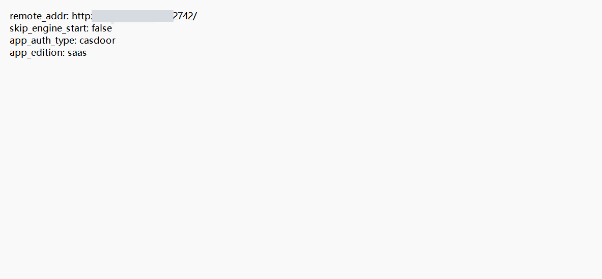

# 安装与启动 FAQ

## 镜像拉取失败 (Download failed) 或速度慢？

这通常是由于国内网络连接 Docker Hub 不稳定导致的。
1. 配置镜像源: 在 /etc/docker/daemon.json  中配置国内加速镜像（如阿里云、网易、南京大
学等）。
- 示例：ghcr.nju.edu.cn  可作为 ghcr.io  的替代。
2. 修改配置: 编辑 docker-compose.yaml ，将镜像地址中的 ghcr.io/  替换为国内镜像源地
址（如 ghcr.nju.edu.cn/ ）。
3. 网络代理: 确保服务器可以访问外部网络，或配置 Docker 代理。

## 启动时提示端口被占用 (Port occupied)？

1. 检查端口: 默认使用8000（Casdoor），80（Nginx），18998（MINIO) 等端口。
2. 修改配置: 在 .env  文件中修改冲突服务的端口映射。
3. Docker冲突: 确保没有旧的容器在运行。尝试 docker compose down 清理后再启动。

## 部署后访问 404 或 502 Bad Gateway？

1. 检查日志: 执行 docker compose logs -f 查看 astron-agent-console-hub或nginx的报错。
2. 等待启动: 服务启动需要时间，特别是第一次拉取镜像和初始化数据库时，请耐心等待。
3. 配置检查: 确认 .env 中的 HOST_BASE_ADDRESS 配置正确（远程部署时应为公网IP/域名，而非localhost）。

## 必须安装 Docker 吗？

是的，Astron Agent 平台依赖 Docker 进行容器化部署。

## 如何更新到最新版本？

1. 拉取代码: git pull origin main
2. 更新镜像: docker compose pull
3. 重启服务:
```
docker compose down
docker compose up -d
```
注意: 如果涉及数据库字段变更，可能需要执行数据库迁移。如果测试环境允许，可使用
docker compose down -v 清空数据重新初始化（慎用，会删除所有数据）。

## Windows 上运行对 Docker Desktop 版本有要求吗？

建议使用 Docker Desktop 4.x 及以上版本，最好使用最新的稳定版，以避免 API 版本不匹配等兼容性问题。

## 启动时遇到 request returned 500 Internal Server Error  报错？

这通常是环境状态不一致导致的，请尝试以下步骤：
1. 备份重要数据。
2. 执行 docker compose -f docker-compose-with-auth.yaml down -v 清理容器和
数据卷（注意：此步骤会删除数据）。
3. 运行 git restore docker 恢复 docker 目录下的文件修改。
4. 检查环境变量 ASTRON_AGENT_VERSION 是否设置为稳定版（如 v1.0.0-rc.x ）。
5. 重新执行 docker compose -f docker-compose-with-auth.yaml up -d  启动服务。
6. 清理浏览器缓存或使用无痕模式访问。

## 如何正确修改默认端口（80）？

在 `.env` 文件中修改 `EXPOSE_NGINX_PORT` 等相关端口配置，然后重建容器生效（`docker compose down` 后 `docker compose up -d`）。

注意：如果同时启用了认证，修改端口后还要同步更新 Casdoor 应用的回调地址，否则登录会因为 `redirect_uri` 不匹配而失败，详见[配置与认证 FAQ](config.md)。

## 为什么用了 `latest` 镜像却不是最新的？如何切换镜像版本？

Docker 的 `latest` 标签只在本地没有该镜像时才会真正去拉取，之后会一直复用本地缓存。

- 想更新到最新：必须显式执行 `docker compose pull`，再 `docker compose up -d`。
- 想锁定版本：在 `.env` 中把 `ASTRON_AGENT_VERSION` 从 `latest` 改成具体版本号（如 `v1.0.0`）。

生产环境推荐锁定具体版本号而不是使用 `latest`，这样环境可控、可回滚。

## 支持在 ARM 架构的机器上部署吗？

支持。`docker compose up` 会读取 `docker-compose.yml` 中的 `image` 字段并执行 `docker pull`，Docker 引擎会根据当前运行环境自动选择匹配的架构版本（在 ARM Mac 上拉取 arm64 镜像，在 x86 服务器上拉取 amd64 镜像）。

## 项目重启后用户数据丢失？

本项目的身份认证系统采用开源框架 Casdoor。如果重启后出现用户数据丢失，请检查 Casdoor 的配置文件 `docker/astronAgent/casdoor/conf/app.conf` 中的 `initDataNewOnly`：

- 该值必须为 `true`。
- 如果为 `false`，Casdoor 每次重启都会重新初始化，用户 ID 会发生变化，从而导致关联的用户数据丢失。

## 打开 RPA 客户端卡在加载界面？

1. 先检查 RPA 服务端各组件是否正常启动、有无异常退出。
2. 再检查 RPA 客户端安装目录下 `resources` 目录中的 conf 配置文件，确认 `remote_addr` 指向的 RPA 服务端 nginx 地址和端口填写正确（端口默认为 `32742`），并确保该地址端口可以正常访问。



## Astron RPA 客户端支持国产信创或麒麟系统吗？

开源版暂不支持，仅企业版支持。开源版客户端目前只支持 Windows。
